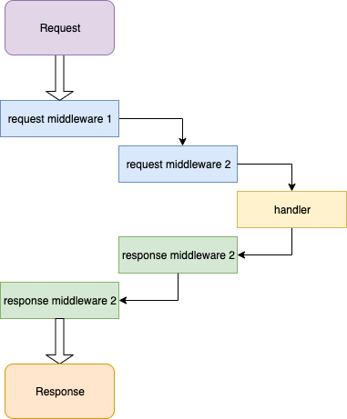

```{r, include = FALSE}
knitr::opts_chunk$set(
  collapse = TRUE,
  comment = "#>", 
  results= 'markup'
)
```

```{r, include = FALSE}
run_bg = function(expr) {
  args = c("--vanilla", "-q")
  expr_c = deparse(substitute(expr))
  expr_c = paste(expr_c, collapse = "\n")
  pid = sys::r_background(c(args, "-e", expr_c), std_out = TRUE, std_err = TRUE)
  return(pid)
}
```

## Middleware

Many web API frameworks contain a concept called "middleware" (but every language/framework calls it differently - filters, middleware, etc). Essentially, the middleware performs some specific function on the HTTP request or response before or after the handler. Common tasks to offload to a middleware would be logging, authorization, body compression, etc.

`RestRserve` comes with several build-in middlewares (`AuthMiddleware`, `CORSMiddleware`) and generic `Middleware` class which facilitates user to create a custom middleware. 

Let's see it in action in example below.


## Logging

Let's say you have a simple app which has only a single endpoint - it simply convert query string parameters into a JSON format and sends it back:
```{r}
library(RestRserve)

app = Application$new(content_type = "application/json")

backend = BackendRserve$new()

app$add_get("/foo", function(request, response) {
  body = RestRserve::to_json(request$parameters_query)
  response$set_body(body)
  # specify that there is no need to specially encode the body as
  # we've already set it to a JSON
  response$encode = identity
})

```

See it in action:

```{r}
req = Request$new(path = "/foo", method = "GET", parameters_query = list(key1 = "value1", key2 = "value2"))
resp = app$process_request(req)
resp$body
```

Assume you would like to analyze how your web service works. For that you may need log every request and response in order to see whether service replies with errors and what can cause these errors. This is a perfect task for a middleware and here is how you can achieve this with `RestRserve`:

```{r}
logging_middleware = Middleware$new(
  process_request = function(request, response) {
    msg = list(
      middleware = "logging_middleware",
      request_id = request$id,
      request = list(headers = request$headers, method = request$method, path = request$path), 
      timestamp = Sys.time()
    )
    msg = RestRserve::to_json(msg)
    cat(msg, sep = '\n')
  },
  process_response = function(request, response) {
    msg = list(
      middleware = "logging_middleware",
      # we would like to have a request_id for each response in order to correlate
      # request and response
      request_id = request$id,
      response = list(headers = response$headers, status_code = response$status_code, body = response$body),
      timestamp = Sys.time()
    )
    msg = to_json(msg)
    cat(msg, sep = '\n')
  },
  id = "logging"
)

app$append_middleware(logging_middleware)
```

Let's test again:
```{r}
req = Request$new(path = "/foo", method = "GET", parameters_query = list(key1 = "value1", key2 = "value2"))
resp = app$process_request(req)
```

Let's see what will happen if we will send request to nonexistent endpoint:
```{r}
req = Request$new(path = "/foo2", method = "GET", parameters_query = list(key1 = "value1", key2 = "value2"))
resp = app$process_request(req)
```

Later you will see all the responses with errors in the log (`status_code` >= 400). Also you will be able to find corresponding requests by inspecting `request_id` field.

## Middleware order

It is important to understand that middlewares are executed in order you've added them (that's why it is called `append_middleware`).  Flow is shown on the diagram below.




## Compression

To demonstrate the order in which middleware called let's consider another example. 

Sometimes it it useful to compress response body in order to send less data over the wire. Here we will implement a middleware which will compress response with `gzip`.

```{r}
gzip_middleware = Middleware$new(
  process_request = function(request, response) {
    msg = list(
      middleware = "gzip_middleware",
      request_id = request$id,
      timestamp = Sys.time()
    )
    msg = to_json(msg)
    cat(msg, sep = '\n')
  },
  process_response = function(request, response) {
    
    # compress body
    response$set_header("Content-encoding", "gzip")
    response$set_body(memCompress(response$body, "gzip"))
    
    msg = list(
      middleware = "gzip_middleware",
      request_id = request$id,
      timestamp = Sys.time()
    )
    msg = to_json(msg)
    cat(msg, sep = '\n')
  },
  id = "gzip"
)
app$append_middleware(gzip_middleware)
```

```{r}
req = Request$new(path = "/foo", method = "GET", parameters_query = list(key1 = "value1", key2 = "value2"))
resp = app$process_request(req)
```
And now check what is actual decoded response body:
```{r}
rawToChar(memDecompress(resp$body, "gzip"))
```

```{r echo = FALSE, eval = FALSE}
pid = run_bg({
  library(RestRserve)
  app = RestRserve::Application$new()
  backend = BackendRserve$new()
  backend$start(app, http_port = 8080)
})
tools::pskill(pid)
```

