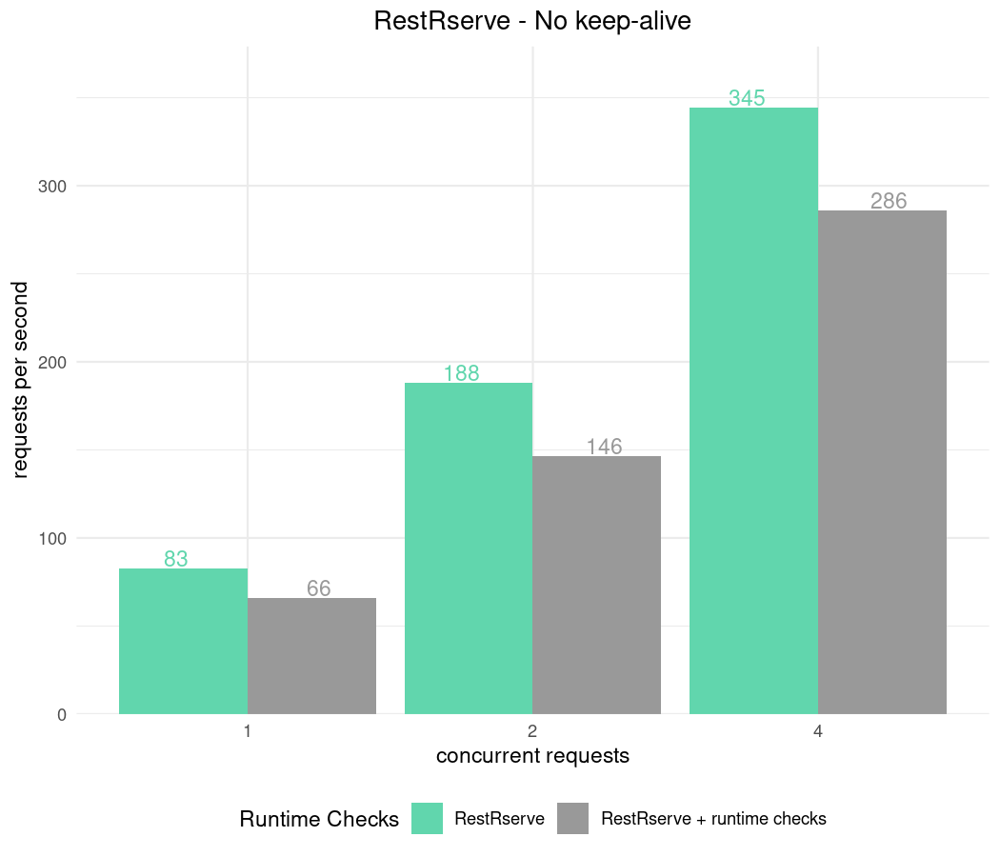
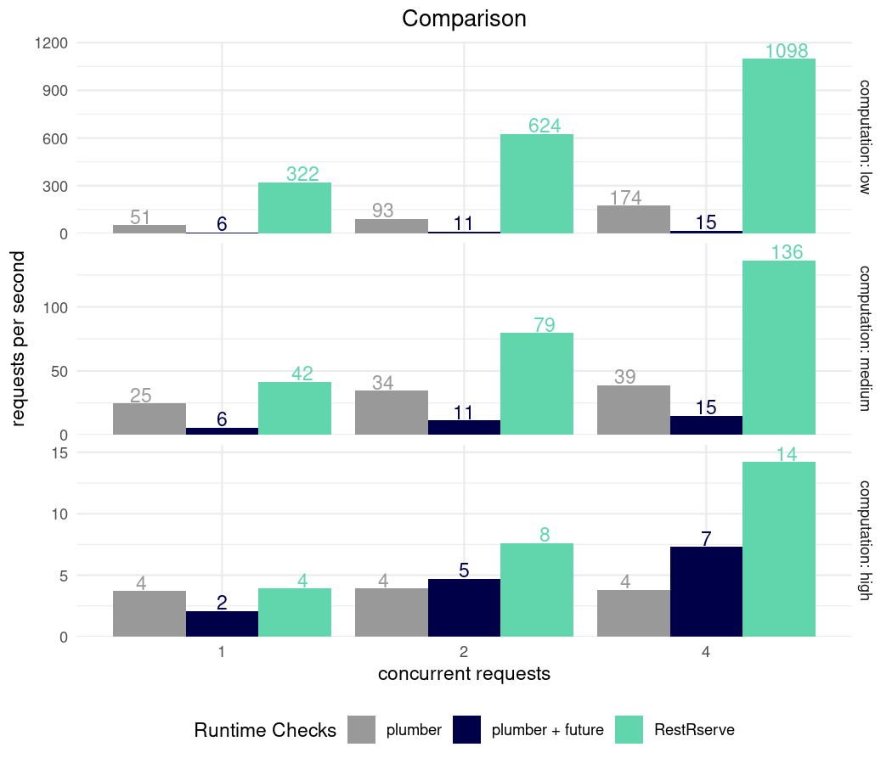

```{r, include = FALSE, cache = FALSE}
knitr::opts_chunk$set(
  collapse = TRUE,
  comment = "#>", 
  results = "markup", 
  # to regenerate the images and clear the output, set eval = TRUE
  eval = FALSE
)
```
*\*All benchmarks below are done on a laptop with Intel i7-8850H CPU @ 2.60GHz - 6 cores, 12 threads.*


There are many tools to benchmark HTTP API. We will use [apib](https://github.com/apigee/apib/releases/tag/APIB_1_0) which is successor of a standard `ab` tool.


We will benchmark a very simple web service - it receives HTTP request at `/fib?n=15` and answers with fibonacci number.

## Details and methodology

Our testing RestRserve application is implemented below:

```{r bench, eval = TRUE}
# a function that can return quickly (n = 15) or very slowly  (n = 25)
calc_fib = function(n) {
  calc_fib_rec = function(n) {
    if (n < 0L) stop("n should be >= 0")
    if (n == 0L) return(0L)
    if (n == 1L || n == 2L) return(1L)
    calc_fib_rec(n - 1) + calc_fib_rec(n - 2)
  }
  calc_fib_rec(n)
}

bench_app = function(calc_fn) {
  
  library(RestRserve)
  backend = BackendRserve$new()
  
  app = Application$new(content_type = "text/plain")
  app$logger$set_log_level("off")
  
  app$add_get("/fib", FUN = function(request, response) {
    n = as.integer(request$get_param_query("n"))
    if (length(n) == 0L || is.na(n)) {
      raise(HTTPError$bad_request())
    }
    response$set_body(list(answer = calc_fn(n)))
  })
  backend$start(app = app, http_port = 8080)
}
```

Sample `calc_fib()` benchmarking:

```{r eval=TRUE}
microbenchmark::microbenchmark(
  low = calc_fib(15),
  medium = calc_fib(20),
  high = calc_fib(25)
)
```


## Benchmarking Rserve backend

At the moment RestRserve supports single backend - [Rserve](http://rforge.net/Rserve/).

Configurations:

- `RestRserve` can utilize all CPU cores and process requests in parallel. We will use multiple number of threads to see how it affects performance.
- During application `RestRserve` checks `RESTRSERVE_RUNTIME_ASSERTS` environment variable. It controls the amount of input validation `RestRserve` performs internally using [checkmate](https://cran.r-project.org/web/packages/checkmate/index.html) package. Despite the fact that runtime checks comes with additional time overhead this variable is set to `TRUE` by default. We value correctness and robustness of the application at the first place. We will benchmark application with different values of `RESTRSERVE_RUNTIME_ASSERTS` to see the difference.


Code below implements allows to test combinations options:
```{r apib, message=FALSE, warning=FALSE}
library(callr)
library(data.table)

parse_apib_results = function(x) {
  csv_header = system2(command = "apib", args = "--header-line", stdout = T)
  csv_header = strsplit(csv_header, ",", T)[[1]]
  csv_header = c("n_threads", "fibonacci", "flavor", csv_header[-1])
  if (length(x) == 1) x = paste0(x, "\n")
  results = paste(x, collapse = "\n")
  fread(results, col.names = csv_header)
}

run_apib = function(
  n_threads = c(1, 2, 4, 6), 
  n_sec = 5, 
  keep_alive = 10000, 
  flavor = "", 
  fib_count = 10
) {
  results = character()
  for (n_thread in n_threads) {
    res = system2(
      command = "apib", 
      args = sprintf(
        "-c %d -d %d -k %d --csv-output \'http://127.0.0.1:8080/fib?n=%d\'", 
        n_thread, n_sec, keep_alive, fib_count
      ),
      stdout = TRUE
    )
    results[[length(results) + 1]] = paste0(n_thread, ",", fib_count, ",", flavor, res)
  }
  results
}

apib_bench = function(
  n_sec = 20, 
  keep_alive = 10000, 
  fib_counts = c(1), 
  runtime_checks = c(FALSE, TRUE)
) {
  results = character()
  for (fib_count in fib_counts) {
    for (runtime_check in runtime_checks) {
      rr = r_bg(
        bench_app, 
        list(calc_fn = calc_fib),
        env = c("RESTRSERVE_RUNTIME_ASSERTS" = as.character(runtime_check))
      )
      # Wait for R to start
      Sys.sleep(2)
      flavor = if (runtime_check) "RestRserve + runtime checks" else "RestRserve"
      results = c(
        results, 
        run_apib(
          n_sec = n_sec, 
          keep_alive = keep_alive, 
          flavor = flavor, 
          fib_count = fib_count
        )
      )
      cat(sep = "",
        "fibonacci: ", fib_count, "; flavor: ", flavor, "\n",
        paste0(rr$read_output(), collapse = "\n"), "\n"
      )
      rr$kill_tree()
    }
  }
  parse_apib_results(results)
}
```


```{r plot_code, echo=FALSE, message=FALSE}
library(ggplot2)
plot_results = function(x, title, file = NULL, facet = FALSE) {
  colour_pal = c(
    "RestRserve" = "#61D6AD", 
    "RestRserve + runtime checks" = "#999999",
    "plumber" = "#999999",
    "plumber + future" = "#000049"
  )
  p = 
    ggplot(x) + 
    geom_bar(aes(x = as.factor(n_threads), y = Throughput, fill = flavor), 
             stat = "identity", position = "dodge") + 
    geom_text(
      aes(x = as.factor(n_threads), y = Throughput, col = flavor, label = round(Throughput)),
      position = position_dodge(width = 1),
      show.legend = FALSE,
      vjust = -0.1
    ) +
    scale_y_continuous(expand = expansion(mult = c(0., 0.1))) +
    scale_fill_manual(values = colour_pal) +
    scale_color_manual(values = colour_pal) +
    theme_minimal() +
    theme(
      plot.title = element_text(hjust = 0.5),
      legend.position = "bottom"
    ) + 
    labs(
      x = "number of threads",
      y = "requests per second",
      title = title,
      fill = "Runtime Checks", 
      col = NULL
    )
  if (facet) {
    p = p + 
      facet_grid(fibonacci ~ ., scales = "free_y", labeller = function(labels) {
        list(
          fibonacci =
            c("15" = "computation: low", "20" = "computation: medium", "25" = "computation: high")[
              label_value(labels)$fibonacci
            ]
        )
      })
  }
  
  if (!is.null(file)) {
    ggsave(file, p, height = 6, width = 7, dpi = "retina")
  }
  p
}
```

```{r apib_1}
results_runtime = apib_bench()
```

```{r apib_1_plot, echo = FALSE}
plot_results(
  results_runtime, 
  "RestRserve", 
  "../img/bench-rps.png"
)
```


## No keep-alive

Keep in mind that creating new connections is quite expensive for any HTTP server. For `RestRserve`'s `Rserve` backend this is particularly true since for each new connection it forks a child process (which has relatively high cost). With other backends slow down might be less significant. 

```{r apib_no_keep_alive}
results_no_keep_alive = apib_bench(keep_alive = 0)
```

```{r apib_no_keep_alive_plot, echo=FALSE}
plot_results(
  results_no_keep_alive, 
  "RestRserve - No keep-alive", 
  "../img/bench-rps-no-keep-alive.png"
)
```


Nonetheless one can always put application behind proxy (such as [HAproxy](http://www.haproxy.org/) or [nginx](https://www.nginx.com/)). It will 
maintain pool of connections to RestRserve and hence won't suffer from creating new connections.

## Comparison with Plumber

Support for [`promises`](https://rstudio.github.io/promises/) and [`future`](https://github.com/HenrikBengtsson/future) was added in [`plumber`](https://www.rplumber.io/) v1.0.0.  Extra coding will need to be done within a plumber definition to distinguish which routes utilize promises.

Here, we will benchmark against three styles of routes (low computation, `n = 15`, ~ 0.6ms; medium computation, `n = 20`, ~ 6ms; high computation, `n = 25`, ~ 60ms) using multiple `apib` testing threads (1, 2, 4, and 6).  

```{r plumber}
plumber_app = function(calc_fn, use_future = FALSE) {
  if (isTRUE(use_future)) {
    # multiple cores
    library(future)
    plan(multiprocess(workers = 6)) # max number of threads
    fib_route = function(n = -1) {
      n = as.integer(n)
      if (is.na(n)) stop("\"n\"must be integer number.")
      future({
        calc_fn(n)
      })
    }
  } else {
    # single core
    fib_route = function(n = -1) {
      n = as.integer(n)
      if (is.na(n)) stop("\"n\"must be integer number.")
      calc_fn(n)
    }
  }

  library(plumber)
  pr() %>%
    pr_get(
      "/fib", 
      fib_route, 
      serializer = plumber::serializer_text()
    ) %>%
    pr_run(port = 8080)
}

apib_bench_plumber = function(
  n_sec = 20, 
  keep_alive = 10000, 
  fib_counts = c(15, 20, 25)
) {
  results = character()

  for (fib_count in fib_counts) {
    for (use_future in list(TRUE, FALSE)) {
      rr = r_bg(
        plumber_app, 
        list(calc_fn = calc_fib, use_future = use_future), 
        stdout = "|", stderr = "2>&1"
      )
      Sys.sleep(2)
      flavor = if (use_future) "plumber + future" else "plumber"
      results = c(
        results, 
        run_apib(
          n_threads = c(1, 2, 4, 6), 
          n_sec = n_sec, 
          keep_alive = keep_alive, 
          flavor = flavor, 
          fib_count = fib_count
        )
      )
      cat(sep = "",
        "fibonacci: ", fib_count, "; flavor: ", flavor, "\n",
        paste0(rr$read_output(), collapse = "\n"), "\n"
      )
      rr$kill_tree()
    }
  }
  parse_apib_results(results)
}
```

```{r apib_compare}
results_restrserve = apib_bench(fib_counts = c(15,20,25), runtime_checks = FALSE)
results_plumber = apib_bench_plumber(fib_counts = c(15,20,25))
results_compare = rbindlist(list(results_plumber, results_restrserve))
```

```{r apib_compare_plot, echo=FALSE}
plot_results(
  results_compare, 
  "Comparison", 
  "../img/bench-rps-vs-plumber.png",
  facet = TRUE
)
```



Due to the overhead of creating a new process for each request in `RServe`, `RestRserve` does not perform as quickly as `plumber` when computing instantaneous routes.  However, `RestRserve` shows it's strength when executing routes that have both low and high computational costs. No extra coding logic is needed to leverage `RestRserve`'s multi-threaded execution. Mixing `plumber` and `future` together for _high computation_ routes brings performance that scales with the number of threads (similar to `RestRserve`), but at the cost of extra route logic and domain knowledge.
