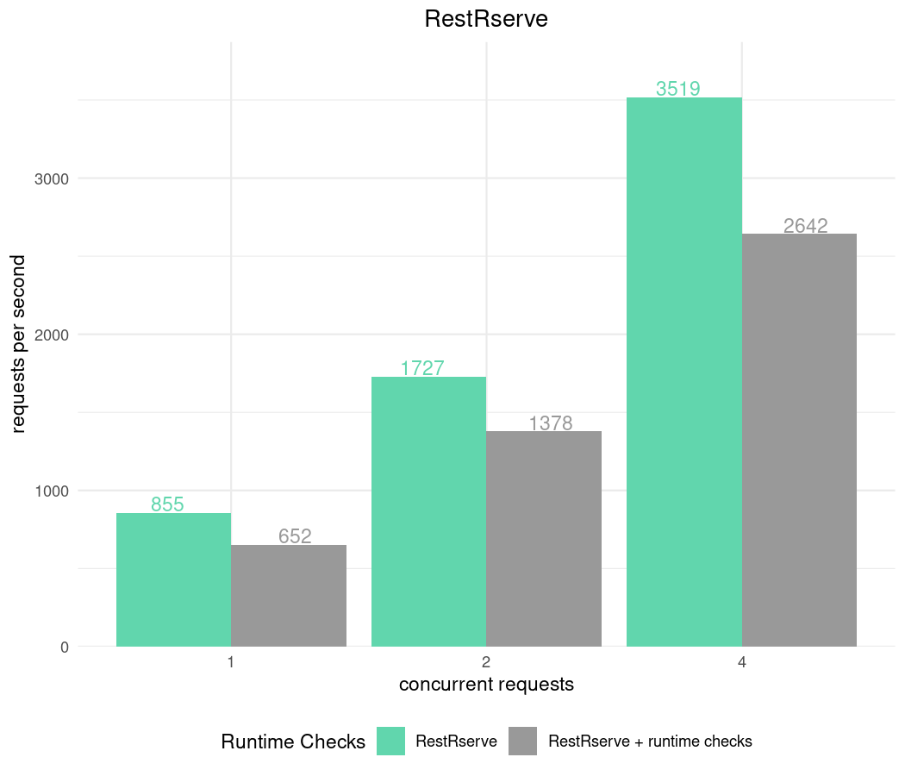

```{r, include = FALSE}
knitr::opts_chunk$set(
  collapse = TRUE,
  comment = "#>", 
  results = 'markup', 
  eval = FALSE
)
```
*\*All benchmarks below are done on a laptop with Intel i7-8850H CPU @ 2.60GHz - 6 cores, 12 threads.*


There are many tools to benchmark HTTP API. We will use [apib](https://github.com/apigee/apib/releases/tag/APIB_1_0) which is successor of a standard `ab` tool.


We will benchmark a very simple web service - it receives HTTP request at `/fib?n=10` and answer with fibonacci number.


## Details and methodology

RestRserve application which implements it looks following:
```{r}
bench_app = function(content_type = "text/plain") {
  
  calc_fib = function(n) {
    if (n < 0L) stop("n should be >= 0")
    if (n == 0L) return(0L)
    if (n == 1L || n == 2L) return(1L)
    x = rep(1L, n)
    for (i in 3L:n) x[[i]] = x[[i - 1]] + x[[i - 2]]
    x[[n]]
  }
  
  library(RestRserve)
  backend = BackendRserve$new()
  
  app = Application$new(content_type = content_type)
  app$logger$set_log_level("off")
  app$add_get("/fib", FUN = function(request, response) {
    n = as.integer(request$get_param_query("n"))
    if (length(n) == 0L || is.na(n)) {
      raise(HTTPError$bad_request())
    }
    response$set_body(list(answer = calc_fib(n)))
  })
  backend$start(app = app, http_port = 8080)
}
```


### Benchmarking Rserve backend

At the moment RestRserve supports single backend - [Rserve](http://rforge.net/Rserve/).

Configurations:

- `RestRserve` can utilize all CPU cores and process requests in parallel. We will use multiple number of threads to see how it affects performance.
- During application `RestRserve` checks `RESTRSERVE_RUNTIME_ASSERTS` environment variable. It controls the amount of input validation `RestRserve` performs internally using [checkmate](https://cran.r-project.org/web/packages/checkmate/index.html) package. Despite the fact that runtime checks comes with additional time overhead this variable is set to `TRUE` by default. We value correctness and robustness of the application at the first place. We will benchmark application with different values of `RESTRSERVE_RUNTIME_ASSERTS` to see the difference.


Code below implements allows to test combinations options:
```{r, message=FALSE, warning=FALSE}
library(callr)
library(data.table)

parse_apib_results = function(x) {
  csv_header = system2(command = "apib", args = "--header-line", stdout = T)
  csv_header = strsplit(csv_header, ",", T)[[1]]
  csv_header = c("n_threads", "runtime_checks", csv_header[-1])
  if (length(x) == 1) x = paste0(x, "\n")
  results = paste(x, collapse = "\n")
  fread(results, col.names = csv_header)
}

run_apib = function(n_threads = c(1, 2, 4, 6), n_sec = 5, keep_alive = 1000, runtime_checks = "FALSE") {
  results = character()
  for (n_threads in n_threads) {
      res = system2(
        command = "apib", 
        args = sprintf("-c %d -d %d -k %d --csv-output http://localhost:8080/fib?n=10", n_threads, n_sec, keep_alive),
        stdout = TRUE
      )
      results[[length(results) + 1]] = paste0(n_threads, ",", runtime_checks, res)
  }
  results
}

apib_bench = function(n_sec, content_type, keep_alive = 1000) {
  results = character()
  for (runtime_checks in c("TRUE", "FALSE")) {
    rr = r_bg(bench_app, env = c("RESTRSERVE_RUNTIME_ASSERTS" = runtime_checks))
    Sys.sleep(1)
    results = c(results, run_apib(n_threads = c(1, 2, 4, 6), n_sec = n_sec, keep_alive = keep_alive, runtime_checks = runtime_checks))
    rr$kill_tree()
  }
  parse_apib_results(results)
}

```


```{r, echo=FALSE, message=FALSE}
library(ggplot2)
plot_results = function(x, title = "text/plain", adj_y_text = 200) {
  colour_pal = c("#61D6AD", "#999999")
  ggplot(x) + 
    geom_bar(aes(x = as.factor(n_threads), y = Throughput, fill = runtime_checks), 
             stat = "identity", position = "dodge") + 
    geom_text(aes(x = as.factor(n_threads), y = Throughput + adj_y_text, col = runtime_checks, label = round(Throughput)), 
              position = position_dodge(width = 1), show.legend = FALSE) + 
    xlab("number of threads") +
    ylab("requests per second") +
    theme_minimal() +
    theme(plot.title = element_text(hjust = 0.5)) + 
    scale_fill_manual(values = colour_pal) +
    scale_color_manual(values = colour_pal) +
    labs(fill = "Runtime Checks", col = NULL) +
    ggtitle(title)
}
```

```{r}
results_json = apib_bench(5, "application/json")
```

```{r, echo = FALSE}
plot_results(results_json, "application/json")
```


### No keep-alive

Keep in mind that creating new connections is quite expensive for any HTTP server. For `RestRserve`'s `Rserve` backend this is particularly true since for each new connection it forks a child process (which has relatively high cost). With other backends slow down might be less significant. 

```{r}
results_no_keep_alive = apib_bench(5, "application/json", keep_alive = 0) 
```

```{r, echo=FALSE}
plot_results(results_no_keep_alive, "application/json", 2)
```


Nonetheless one can always put application behind proxy (such as [HAproxy](http://www.haproxy.org/) or [nginx](https://www.nginx.com/)). It will 
maintain pool of connections to RestRserve and hence won't suffer from creating new connections.

### Comparison with Plumber

At the moment of writing the most popular way to develop a web service is to use [plumber](https://www.rplumber.io/) package. Unfortunately it doesn't support parallel request processing. So will benchmark it with a single thread.

We need to write following code to `plumber-fib.R`:

```{bash}
echo '
# function to calc Fibonacci numbers
calc_fib = function(n) {
  if (n < 0L) stop("n should be >= 0")
  if (n == 0L) return(0L)
  if (n == 1L || n == 2L) return(1L)
  x = rep(1L, n)
  for (i in 3L:n) x[[i]] = x[[i - 1]] + x[[i - 2]]
  x[[n]]
}

#* Fibonacci numbers calculation
#* @param n Integer number
#* @get /fib
#* @serializer unboxedJSON
function(n) {
  n = as.integer(n)
  if (is.na(n)) {
    stop("\"n\"must be integer number.")
  }
  calc_fib(n)
}' > plumber-fib.R
```

Start with:
```{bash, eval = FALSE}
Rscript -e "plumber::plumb('plumber-fib.R')\$run(port = 8080)"
```


```{r}
results_plumber = run_apib(1, n_sec = 5)
results_plumber = parse_apib_results(results_plumber)
```

```{r, echo=FALSE}
rr = results_json[n_threads == 1 & runtime_checks == FALSE]
rr[, pkg := "RestRserve"]
p = copy(results_plumber)
p[, pkg := "plumber"]
results_compare = rbindlist(list(rr, p))

```

```{r, echo=FALSE}
colour_pal = c("#999999", "#61D6AD")
ggplot(results_compare) + 
  geom_bar(aes(x = as.factor(n_threads), y = Throughput, fill = pkg), 
           stat = "identity", position = "dodge") + 
  geom_text(aes(x = as.factor(n_threads), y = Throughput + 100, col = pkg, label = round(Throughput)), 
            position = position_dodge(width = 1), show.legend = FALSE) + 
  xlab("number of threads") +
  ylab("requests per second") +
  theme_minimal() +
  theme(plot.title = element_text(hjust = 0.5)) + 
  scale_fill_manual(values = colour_pal) +
  scale_color_manual(values = colour_pal) +
  labs(fill = "package", col = NULL) +
  ggtitle("plumber vs RestRserve")
```

